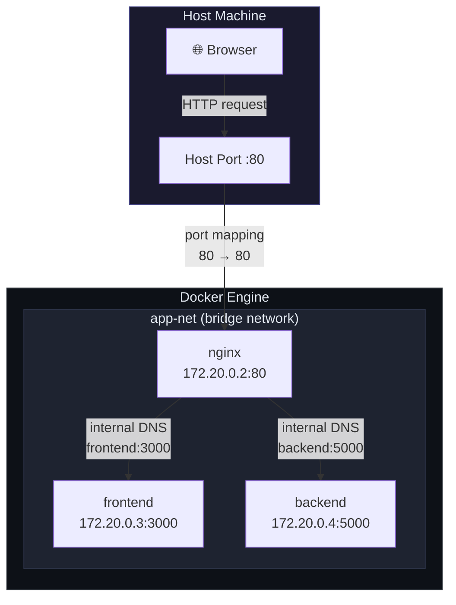
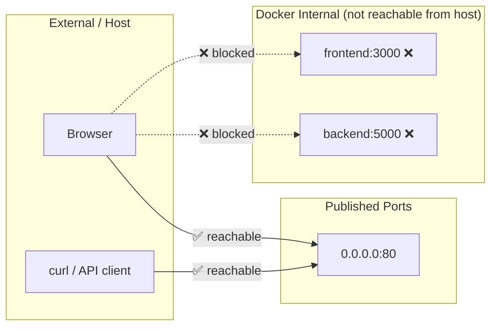
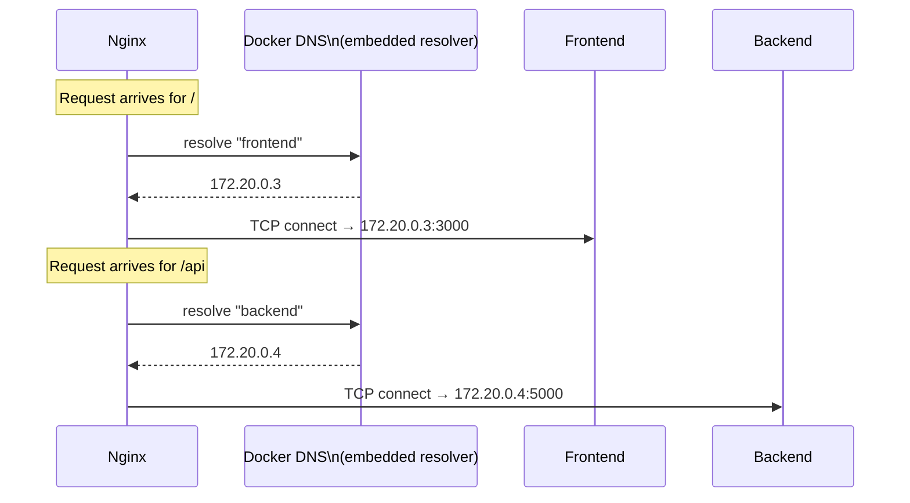
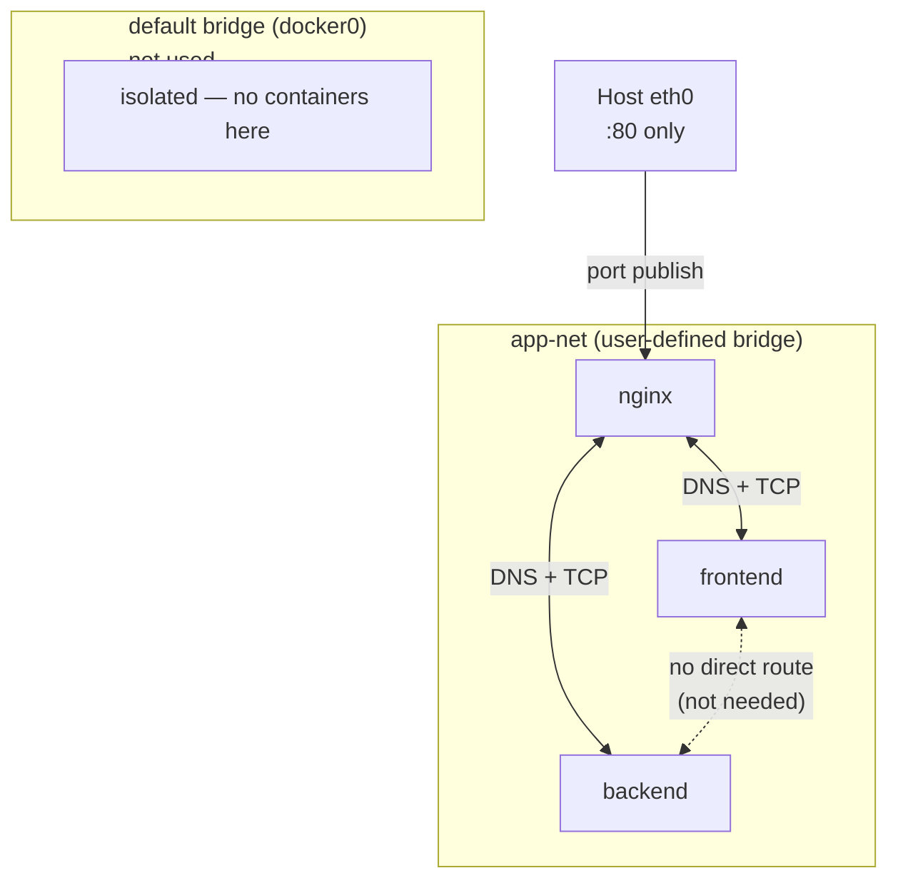
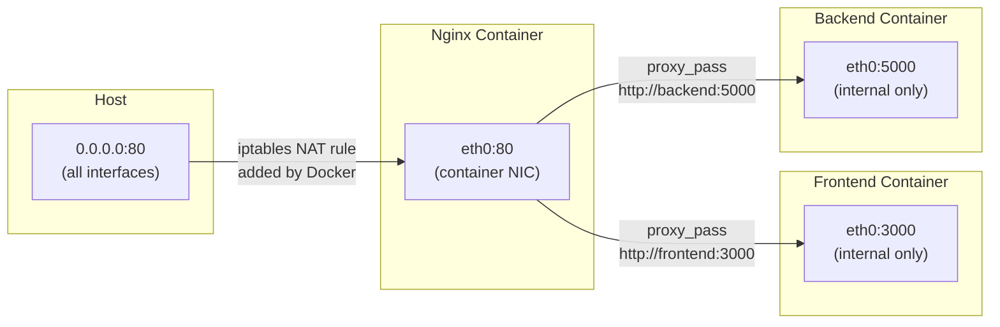
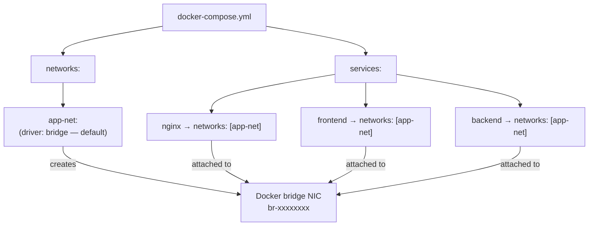
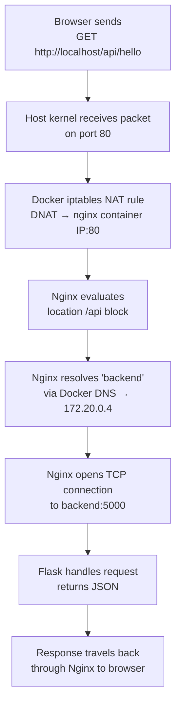

# Docker Networking — Nginx Reverse Proxy

## Overview

Docker networking in this project separates **external traffic** (what the host machine and browser can reach) from **internal traffic** (container-to-container communication invisible to the outside world).

---

## Big Picture — External vs Internal

> **Note:** IP addresses shown are illustrative. Docker assigns them dynamically from the bridge subnet.

---

## External Networking — Host to Docker

Only one port is published to the host. The frontend and backend are fully isolated from the host network.

---

## Internal Networking — Container DNS Resolution

Docker's embedded DNS server automatically registers each service name as a hostname inside `app-net`. No `/etc/hosts` editing or IP hardcoding is needed.

---

## Network Isolation Model

User-defined bridge networks (like `app-net`) provide:
- **Automatic DNS** — containers resolve each other by service name.
- **Isolation** — containers on `app-net` cannot communicate with containers on other networks unless explicitly connected.
- **No link flags needed** — unlike the legacy default bridge, no `--link` required.

---

## Port Mapping Detail

---

## docker-compose.yml — Network Declarations

---

## Inbound Packet Journey

---

## What Is and Isn't Exposed

| Resource | Exposed to Host | Exposed on app-net |
|---|---|---|
| `nginx` port 80 | ✅ Yes — mapped to host :80 | ✅ Yes |
| `frontend` port 3000 | ❌ No | ✅ Yes (nginx only) |
| `backend` port 5000 | ❌ No | ✅ Yes (nginx only) |
| Container-to-container DNS | N/A | ✅ Automatic |

---

## Key Takeaways

- **One public surface** — only port 80 on Nginx is reachable from outside Docker.
- **Service-name DNS** — Docker's built-in resolver means `proxy_pass http://backend:5000` works without any IP configuration.
- **Bridge isolation** — `app-net` is a private L2 segment; traffic between containers never leaves the Docker host.
- **iptables integration** — Docker automatically manages NAT rules for published ports; no manual firewall config needed.
- **depends_on order** — Nginx waits for `frontend` and `backend` to start before itself, preventing failed proxy connections on cold start.
