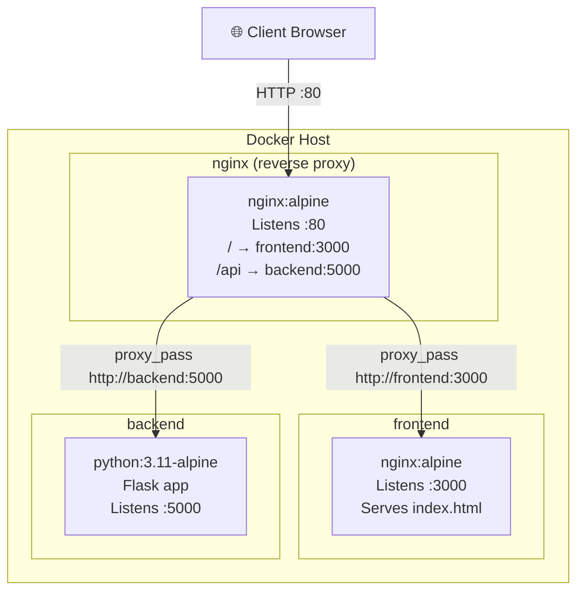
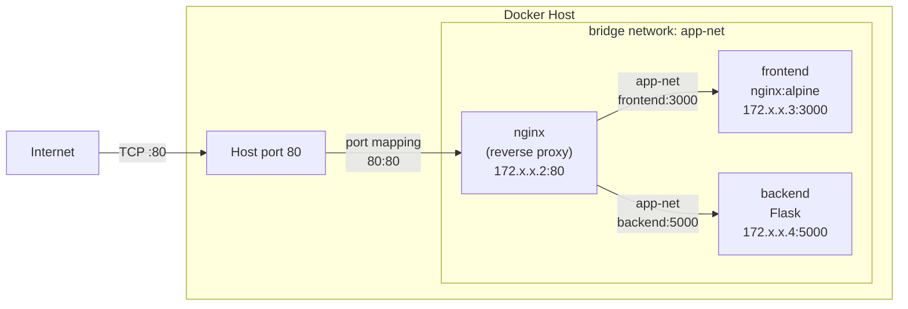
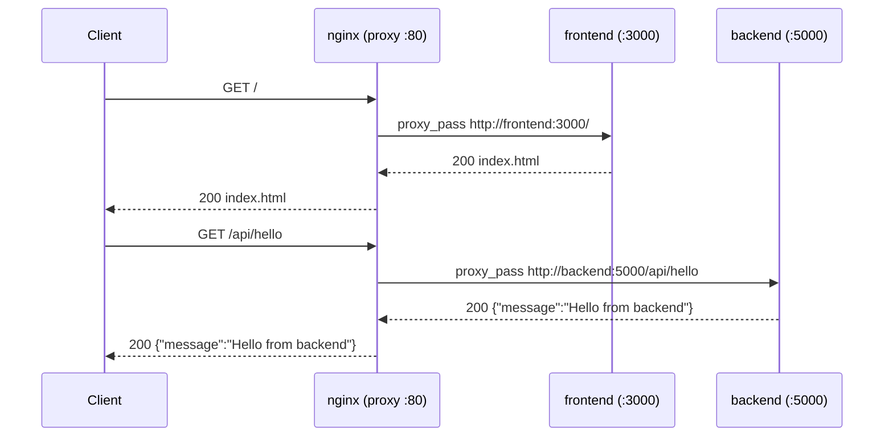

# Nginx Reverse Proxy Demo

A containerised three-tier web application that demonstrates how an Nginx reverse proxy routes external HTTP traffic to separate frontend and backend services — all running on a shared Docker bridge network.

---

## Project Structure

```
Reverse_proxy/
├── docker-compose.yml
├── nginx/
│   └── nginx.conf          # Reverse proxy configuration
├── backend/
│   ├── app.py              # Flask REST API (port 5000)
│   └── Dockerfile
└── frontend/
    ├── index.html          # Static UI
    ├── default.conf        # Nginx serving config (port 3000)
    └── Dockerfile
```

---

## Architecture Diagram



---

## Docker Networking Diagram



> All three containers share the `app-net` bridge network. Only the `nginx` container has a port exposed to the host (`80:80`). The `frontend` and `backend` containers are reachable **only** via their service names on the internal network — they are not accessible from outside the Docker host.

---

## Request Flow



---

## Services

| Service    | Image / Base      | Internal Port | Exposed to Host |
|------------|-------------------|:-------------:|:---------------:|
| `nginx`    | `nginx:alpine`    | 80            | **:80**         |
| `frontend` | `nginx:alpine`    | 3000          | none            |
| `backend`  | `python:3.11-alpine` | 5000       | none            |

---

## API Endpoints

| Method   | Path                    | Description               |
|----------|-------------------------|---------------------------|
| `GET`    | `/api/hello`            | Returns a greeting message |
| `GET`    | `/api/health`           | Health check               |
| `PUT`    | `/api/items/<id>`       | Update an item by ID       |
| `DELETE` | `/api/items/<id>`       | Delete an item by ID       |

---

## Nginx Routing Rules

```nginx
location / {
    proxy_pass http://frontend:3000;   # All other requests → frontend
}

location /api {
    proxy_pass http://backend:5000;    # /api/* requests → backend
    proxy_set_header Host       $host;
    proxy_set_header X-Real-IP  $remote_addr;
}
```

---

## Getting Started

### Prerequisites

- [Docker](https://docs.docker.com/get-docker/) and [Docker Compose](https://docs.docker.com/compose/) installed.

### Run

```bash
docker compose up --build
```

### Access

| URL                          | What you see              |
|------------------------------|---------------------------|
| `http://localhost/`          | Frontend UI               |
| `http://localhost/api/hello` | Backend JSON response     |
| `http://localhost/api/health`| Backend health check      |

### Stop

```bash
docker compose down
```

---

## How the Reverse Proxy Works

1. The client sends all requests to **port 80** on the Docker host.
2. The `nginx` reverse proxy container receives every request.
3. Based on the URL path it forwards the request to the correct internal service:
   - `/*` → `frontend:3000` (static HTML served by Nginx)
   - `/api/*` → `backend:5000` (Flask REST API)
4. Because both destination services are on the same `app-net` Docker network, nginx can resolve their hostnames (`frontend`, `backend`) via Docker's built-in DNS.
5. The response travels back through nginx to the client — the client never communicates with the internal services directly.
