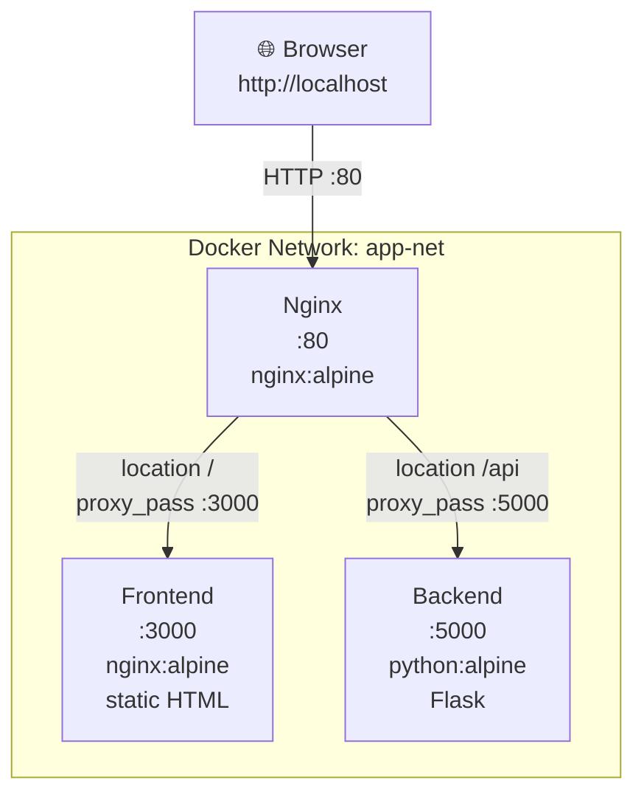
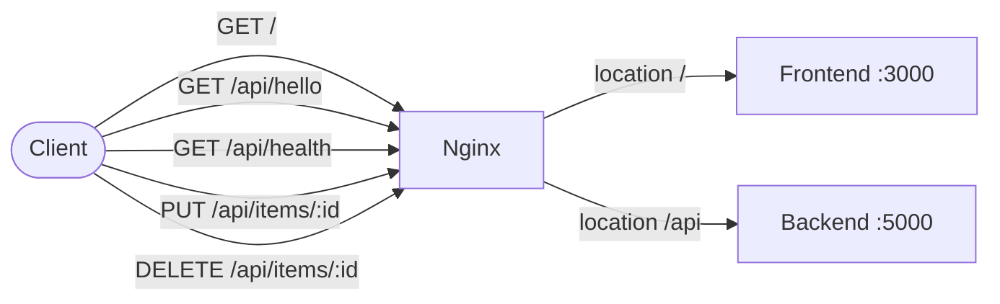
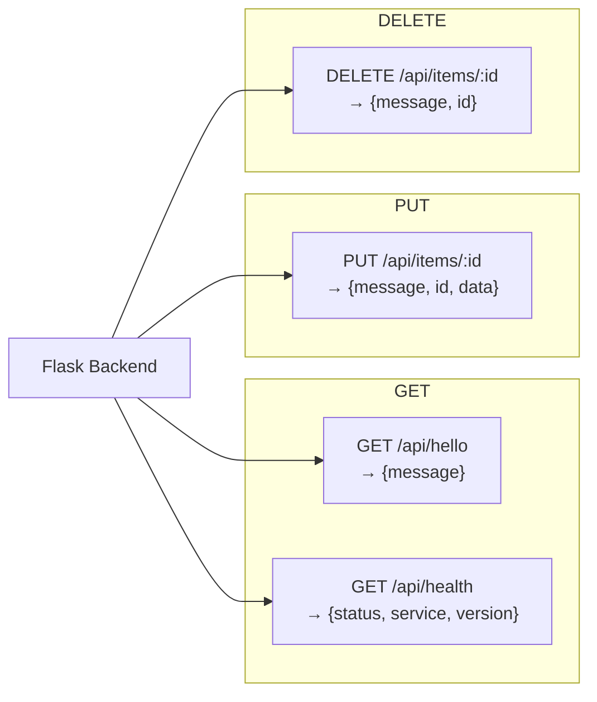
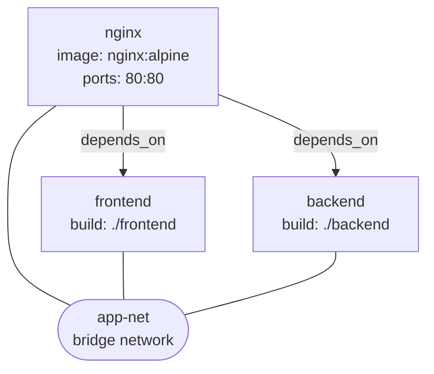
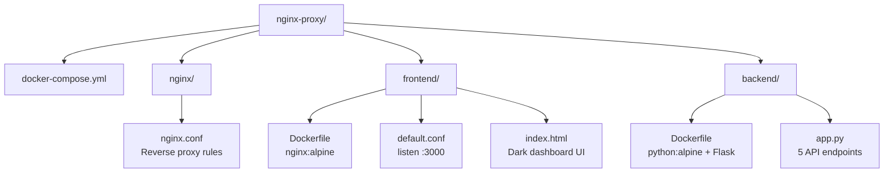
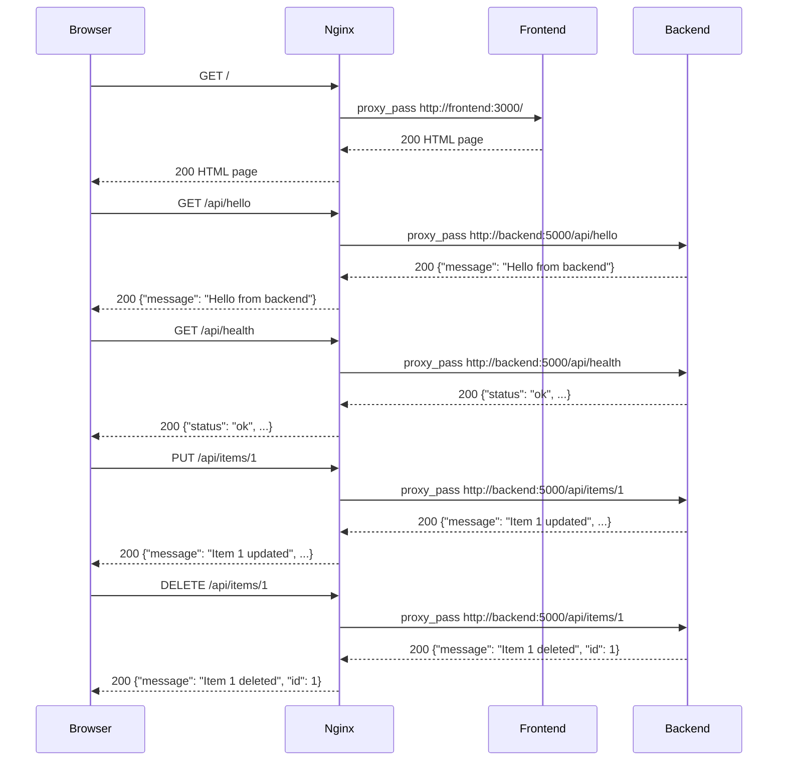

# Nginx Reverse Proxy — Architecture

## Overview

A three-container Docker application where Nginx acts as the single entry point, routing traffic to either the frontend static server or the Flask backend API — all on an isolated Docker network.

---

## Container Layout

---

## Request Routing

---

## API Endpoints

---

## Docker Compose Service Graph

---

## File Structure

---

## Traffic Flow — Sequence

---

## Key Design Points

- **Single exposed port** — only Nginx is published on host port `80`. Frontend and Backend are not reachable from outside Docker.
- **Docker internal DNS** — Nginx resolves `frontend` and `backend` by service name; no hardcoded IPs.
- **Read-only config mount** — `nginx.conf` is mounted as `:ro` so the container cannot modify it.
- **No data layer** — all API responses are stateless; PUT and DELETE echo back the request without persisting anything.
