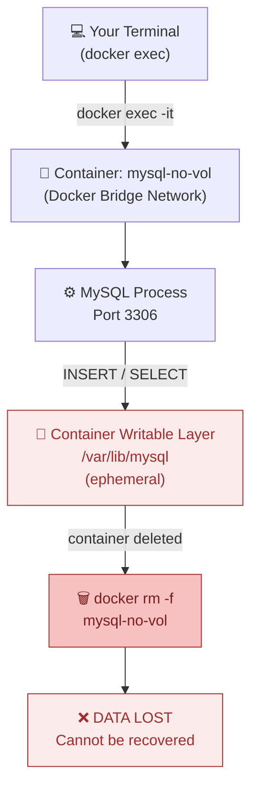
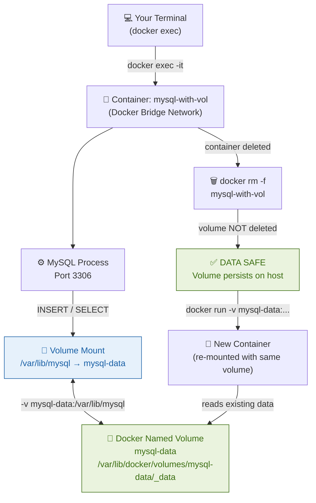

# Docker Data Persistence with MySQL — Video Demo Guide

> **Objective:** Show how Docker volumes keep data alive across container deletion and recreation.  
> **Follow the parts in order during your recording.**

---

## Architecture Overview

### Case 1 — Without Volumes (Ephemeral Storage)

```
┌─────────────────────────────────────────────────────────────────┐
│                         HOST MACHINE                            │
│                                                                 │
│   ┌─────────────────────────────────────┐                       │
│   │        Docker Container             │                       │
│   │        (mysql-no-vol)               │                       │
│   │                                     │                       │
│   │   ┌──────────────────────────────┐  │                       │
│   │   │       MySQL 8.0 Process      │  │                       │
│   │   └──────────────┬───────────────┘  │                       │
│   │                  │ reads/writes      │                       │
│   │   ┌──────────────▼───────────────┐  │                       │
│   │   │  Container Writable Layer    │  │                       │
│   │   │  /var/lib/mysql  (ephemeral) │  │                       │
│   │   │                              │  │                       │
│   │   │  testdb/users table ← DATA   │  │                       │
│   │   └──────────────────────────────┘  │                       │
│   │                                     │                       │
│   └─────────────────────────────────────┘                       │
│                        │                                        │
│              docker rm -f  ──► Container deleted                │
│                        │                                        │
│                        ▼                                        │
│              ╔══════════════════════╗                           │
│              ║   DATA LOST FOREVER  ║                           │
│              ╚══════════════════════╝                           │
│                                                                 │
└─────────────────────────────────────────────────────────────────┘
```

**Key point:** Data is stored inside the container's writable layer. When the container is removed, the layer is destroyed along with all data.

---

### Case 2 — With Volumes (Persistent Storage)

```
┌─────────────────────────────────────────────────────────────────┐
│                         HOST MACHINE                            │
│                                                                 │
│   ┌─────────────────────────────────────┐                       │
│   │        Docker Container             │                       │
│   │        (mysql-with-vol)             │                       │
│   │                                     │                       │
│   │   ┌──────────────────────────────┐  │                       │
│   │   │       MySQL 8.0 Process      │  │                       │
│   │   └──────────────┬───────────────┘  │                       │
│   │                  │ reads/writes      │                       │
│   │   ┌──────────────▼───────────────┐  │                       │
│   │   │  Mount Point (in container)  │  │                       │
│   │   │  /var/lib/mysql              │◄─┼──── Volume Mount      │
│   │   └──────────────────────────────┘  │         │             │
│   │                                     │         │             │
│   └─────────────────────────────────────┘         │             │
│                        │                          │             │
│              docker rm -f  ──► Container deleted  │             │
│                                                   │             │
│   ┌───────────────────────────────────────────────┘             │
│   │                                                             │
│   │   ┌──────────────────────────────────────────┐             │
│   │   │          Docker Named Volume             │             │
│   │   │              mysql-data                  │             │
│   │   │                                          │             │
│   │   │  /var/lib/docker/volumes/mysql-data/_data│             │
│   │   │                                          │             │
│   │   │   testdb/users table ← DATA SAFE ✓       │             │
│   │   └──────────────────────────────────────────┘             │
│   │                        │                                   │
│   │       New container ───┘  (re-mounts same volume)          │
│   │                                                             │
│   │   ╔════════════════════════════╗                            │
│   │   ║  DATA PERSISTED ✓          ║                            │
│   │   ╚════════════════════════════╝                            │
│   │                                                             │
└───┴─────────────────────────────────────────────────────────────┘
```

**Key point:** Data lives in the named volume on the host, completely independent of any container. The container can be deleted and recreated — the volume and its data remain intact.

---

## Network Diagram — How the Two Cases Differ

### Case 1: Without Volumes — Data Flow



---

### Case 2: With Volumes — Data Flow



---

## Architecture Comparison — Side by Side

```
WITHOUT VOLUME                        WITH VOLUME
══════════════════════════════        ══════════════════════════════════════
                                      
  HOST                                  HOST
  ┌──────────────────────┐             ┌──────────────────────────────────┐
  │  ┌────────────────┐  │             │  ┌────────────────┐              │
  │  │   Container    │  │             │  │   Container    │              │
  │  │                │  │             │  │                │              │
  │  │  MySQL         │  │             │  │  MySQL         │              │
  │  │  /var/lib/mysql│  │             │  │  /var/lib/mysql│◄──┐          │
  │  │  [DATA HERE]   │  │             │  │  (mount point) │   │ -v flag  │
  │  └────────────────┘  │             │  └────────────────┘   │          │
  │                      │             │                        │          │
  │  docker rm ──► gone  │             │  docker rm ──► container gone    │
  │  DATA DELETED ❌      │             │                        │          │
  └──────────────────────┘             │  ┌─────────────────────┴──────┐  │
                                       │  │   Named Volume: mysql-data  │  │
                                       │  │   DATA PERSISTS ✅           │  │
                                       │  └────────────────────────────┘  │
                                       └──────────────────────────────────┘
```

---

## Part 1 — Without Volumes (The Problem)

> 🎙 *Narrate: "We'll first show what happens when you run MySQL without a volume — so the audience understands why volumes are needed."*

### Step 1 — Start MySQL with no volume

```bash
docker run --name mysql-no-vol \
  -e MYSQL_ROOT_PASSWORD=root123 \
  -e MYSQL_DATABASE=testdb \
  -d mysql:8.0
```

> 🎙 *Say: "We're starting MySQL with no volume — all data lives only inside this container."*

---

### Step 2 — Wait ~15 seconds, then connect

```bash
docker exec -it mysql-no-vol mysql -uroot -proot123
```

> 🎙 *Say: "Now we're inside the MySQL shell."*

---

### Step 3 — Create a table and insert data

```sql
USE testdb;

CREATE TABLE users (
  id   INT AUTO_INCREMENT PRIMARY KEY,
  name VARCHAR(50)
);

INSERT INTO users (name) VALUES ('Alice'), ('Bob');

SELECT * FROM users;
```

**Expected output:**

```
+----+-------+
| id | name  |
+----+-------+
|  1 | Alice |
|  2 | Bob   |
+----+-------+
```

> 🎙 *Say: "We have two users — Alice and Bob — stored in the database."*

---

### Step 4 — Exit the MySQL shell

```bash
exit
```

---

### Step 5 — Delete the container

```bash
docker rm -f mysql-no-vol
```

> 🎙 *Say: "We're deleting the container — this also destroys everything stored inside it."*

---

### Step 6 — Recreate the same container

```bash
docker run --name mysql-no-vol \
  -e MYSQL_ROOT_PASSWORD=root123 \
  -e MYSQL_DATABASE=testdb \
  -d mysql:8.0
```

---

### Step 7 — Wait ~15 seconds, then try to find the data

```bash
docker exec -it mysql-no-vol mysql -uroot -proot123 \
  -e 'USE testdb; SELECT * FROM users;'
```

**Expected output:**

```
ERROR 1146 (42S02): Table 'testdb.users' doesn't exist
```

> 🎙 *Say: "The table is gone. The data was lost when we deleted the container. This is the problem Docker volumes solve."*

---

### Step 8 — Clean up

```bash
docker rm -f mysql-no-vol
```

---

## Part 2 — Create & Inspect a Named Volume

> 🎙 *Narrate: "Now let's create a Docker volume and inspect it before we use it with MySQL."*

### Step 1 — Create a named volume

```bash
docker volume create mysql-data
```

> 🎙 *Say: "We're creating a named volume called mysql-data. Docker manages this storage on the host machine."*

---

### Step 2 — List all volumes

```bash
docker volume ls
```

**Expected output:**

```
DRIVER    VOLUME NAME
local     mysql-data
```

> 🎙 *Say: "You can see our mysql-data volume is now registered with Docker."*

---

### Step 3 — Inspect the volume

```bash
docker volume inspect mysql-data
```

**Expected output:**

```json
[
  {
    "CreatedAt": "...",
    "Driver": "local",
    "Mountpoint": "/var/lib/docker/volumes/mysql-data/_data",
    "Name": "mysql-data",
    "Scope": "local"
  }
]
```

> 🎙 *Say: "The Mountpoint tells us exactly where on the host filesystem Docker is storing the data — outside any container."*

---

## Part 3 — With Volumes (The Solution)

> 🎙 *Narrate: "Now we do the same thing as Part 1, but this time we attach the volume using the -v flag."*

### Step 1 — Start MySQL WITH the named volume

```bash
docker run --name mysql-with-vol \
  -e MYSQL_ROOT_PASSWORD=root123 \
  -e MYSQL_DATABASE=testdb \
  -v mysql-data:/var/lib/mysql \
  -d mysql:8.0
```

> 🎙 *Say: "The key difference is the -v flag: mysql-data:/var/lib/mysql — this maps our volume to the directory where MySQL stores all its data."*

---

### Step 2 — Wait ~15 seconds, then connect

```bash
docker exec -it mysql-with-vol mysql -uroot -proot123
```

---

### Step 3 — Create the same table and insert data

```sql
USE testdb;

CREATE TABLE users (
  id   INT AUTO_INCREMENT PRIMARY KEY,
  name VARCHAR(50)
);

INSERT INTO users (name) VALUES ('Alice'), ('Bob');

SELECT * FROM users;
```

**Expected output:**

```
+----+-------+
| id | name  |
+----+-------+
|  1 | Alice |
|  2 | Bob   |
+----+-------+
```

> 🎙 *Say: "Same data — Alice and Bob are in the table."*

---

### Step 4 — Exit the MySQL shell

```bash
exit
```

---

### Step 5 — Delete the container

```bash
docker rm -f mysql-with-vol
```

> 🎙 *Say: "We're deleting the container again — but this time, the volume exists separately and is NOT deleted."*

---

### Step 6 — Confirm the volume is still there

```bash
docker volume ls
```

**Expected output:**

```
DRIVER    VOLUME NAME
local     mysql-data
```

> 🎙 *Say: "The volume is untouched. The data is safe on the host."*

---

### Step 7 — Recreate the container with the SAME volume

```bash
docker run --name mysql-with-vol \
  -e MYSQL_ROOT_PASSWORD=root123 \
  -e MYSQL_DATABASE=testdb \
  -v mysql-data:/var/lib/mysql \
  -d mysql:8.0
```

> 🎙 *Say: "Same command, same volume — let's see if our data survived."*

---

### Step 8 — Wait ~15 seconds, then check for data ⬅ KEY MOMENT

```bash
docker exec -it mysql-with-vol mysql -uroot -proot123 \
  -e 'USE testdb; SELECT * FROM users;'
```

**Expected output:**

```
+----+-------+
| id | name  |
+----+-------+
|  1 | Alice |
|  2 | Bob   |
+----+-------+
```

> 🎙 *Say: "Alice and Bob are back! The data survived container deletion and recreation — because it was stored in the volume, not the container."*

---

## Part 4 — Cleanup

> 🎙 *Narrate: "Let's clean everything up to finish the demo."*

### Step 1 — Remove the container

```bash
docker rm -f mysql-with-vol
```

---

### Step 2 — Remove the volume

```bash
docker volume rm mysql-data
```

> 🎙 *Say: "To permanently delete the data, you must explicitly remove the volume. Docker never auto-deletes named volumes."*

---

### Step 3 — Confirm everything is gone

```bash
docker volume ls
```

**Expected output:**

```
DRIVER    VOLUME NAME
```

> 🎙 *Say: "Clean slate. That's Docker volumes — simple, powerful, and essential for any stateful application."*

---

## Summary — What to Highlight for Reviewers

| Scenario | Command key | Data after container delete? |
|---|---|---|
| No volume | *(none)* | ❌ Lost |
| Named volume | `-v mysql-data:/var/lib/mysql` | ✅ Persisted |

**Core concept demonstrated:**
- `docker volume create` — creates a named volume
- `docker volume ls` — lists volumes
- `docker volume inspect` — shows host mountpoint
- `-v <volume>:<container-path>` — mounts volume into container
- Data survives `docker rm -f` when stored in a volume

---

*Recording tip: Keep a split terminal so viewers see both commands and output side by side.*
